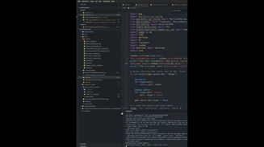

<h1 align="center" id="title">hierarchical autonomous racing with pit stops</h1>

Environment and base models for training and deploying multi or single agent races for hierarchical RL approaches.

<h2>🚀 Demo</h2>

<h2>🧐 Status</h2>

We are currently working on transferring over the project to IsaacLab

<h2>🎥 Video Demos</h2>

<!-- Place to view the first GIF -->

<!-- Place to view the second GIF -->

<h2>📐 Architecture Diagram</h2>

<h2>🛠️ Installation Steps:</h2>

1. 🔧 Clone the Repository

<pre>
git clone https://github.com/ghssx19/RL-Project-Gym.git
</pre>

2. Directory

<pre>
cd multi_car_racing
</pre>

3. Conda

<pre>
conda env create -f conda_explicit.txt
</pre>

4. Pip

<pre>
pip install -r pip_frozen.txt
</pre>

<h2>▶️ Running the Code</h2>

To see the main simulation where a single agent is performing pit stops, run the following command:

<pre>
python main.py
</pre>

This will launch the simulation environment where you can observe the agent's behavior and pit stop strategy in action.

